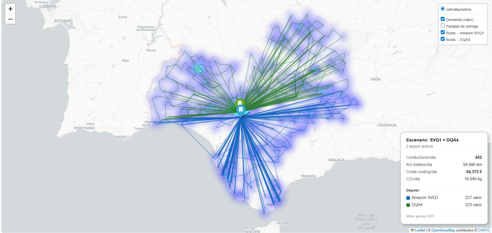
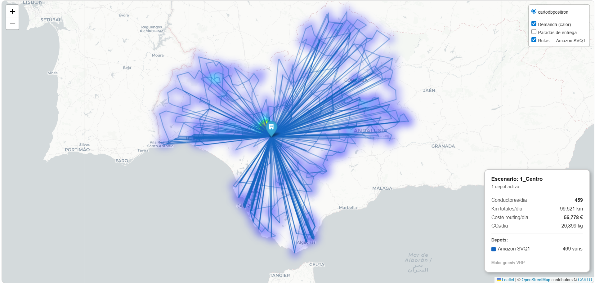
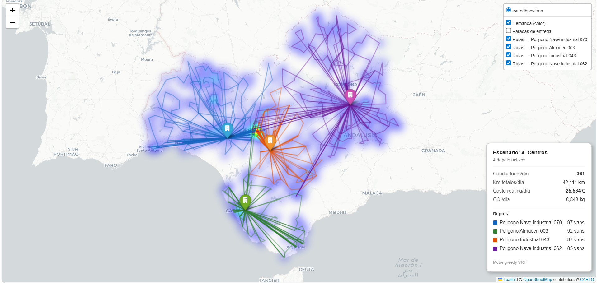
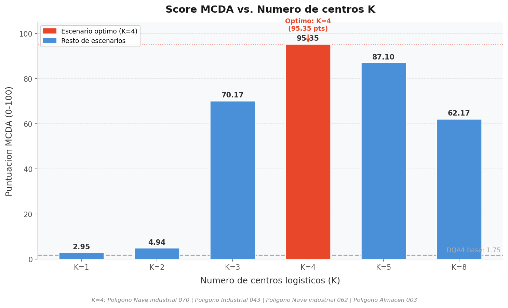
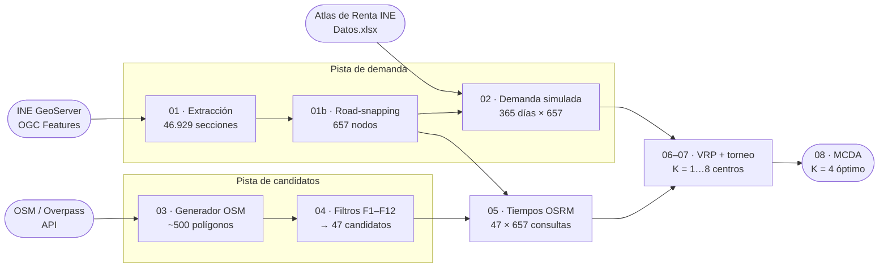
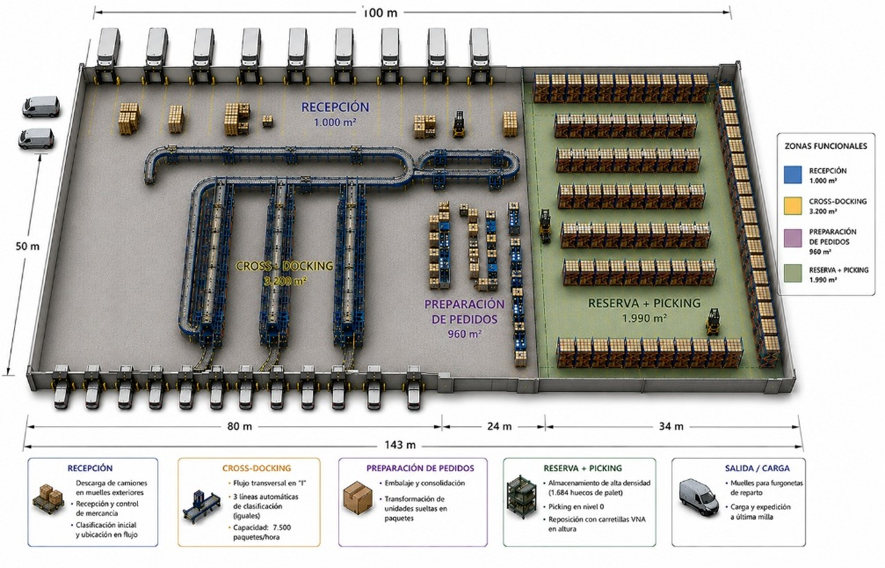
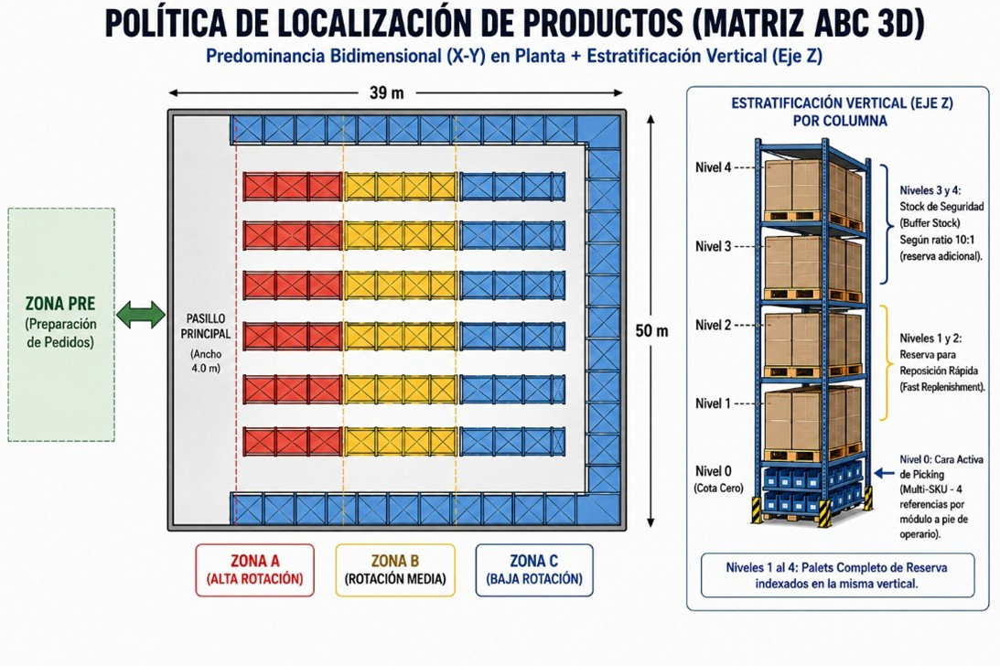
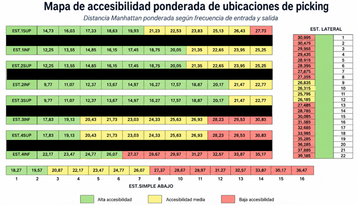

# Diseño de red logística de última milla

**657 secciones censales · 500 emplazamientos candidatos · VRP + MCDA · de 2 centros a 4: −56 % km/día y −49 % de coste operativo anual**

Pipeline reproducible en Python que va desde datos abiertos (INE, OpenStreetMap, OSRM) hasta
una recomendación ejecutiva de red de distribución, pasando por la localización de centros, el
enrutamiento de la flota y el diseño intralogístico de las naves.


<!-- MEMORIA:INICIO — descomentar al publicar docs/memoria_proyecto.pdf
📄 **[Memoria completa (50 páginas, PDF)](docs/memoria_proyecto.pdf)** ·
MEMORIA:FIN -->
🗺️ **[Mapas interactivos](docs/mapas/)** (7 escenarios navegables, HTML)

---

## El problema

Un operador logístico sirve Andalucía Occidental —Sevilla, Huelva, Córdoba y Cádiz— desde dos
instalaciones: un gran centro de distribución en Dos Hermanas y una estación de entrega de
última milla en la capital. Dos tercios del volumen que sale de la estación de entrega llega
antes en camión desde el centro de distribución, recorriendo 25 km en un trasvase diario que
no añade valor.

La pregunta de partida era binaria: **¿conviene unificar ambos centros en uno solo?**

La respuesta del estudio es **no**, y la parte interesante es la tercera opción que aparece al
plantear el problema como un diseño de red en lugar de como una decisión de sí o no.

## Veredicto

> ### NO a la unificación
> Concentrar toda la operación en un único centro es la peor de las tres alternativas evaluadas,
> tanto en coste como en nivel de servicio.
>
> **La red de 4 centros optimizados gana en todos los criterios cuantitativos.**

| | Por qué |
|---|---|
| **Coste sin retorno** | La unificación exige 28,5 M€ de CAPEX con *payback* de 4,3 años. La red de 4 centros cuesta 5,2 M€ y se amortiza en ~2 meses. Se gasta cinco veces más para ahorrar menos. |
| **Peor servicio** | Un solo depósito en Dos Hermanas deja la cobertura en **44 %** de la demanda entregable en menos de 60 min, la más baja de las tres opciones, frente al **83,2 %** de la red distribuida. |
| **Sin margen en picos** | El centro opera ya al 78 % de capacidad. Absorber el volumen de la estación de entrega lo llevaría a ~109 % de utilización media en el cuarto trimestre, por encima del techo de diseño. |

## Resultados

| Indicador | Alt. 1 — Unificar | Alt. 2 — Sin modificar | **Alt. 3 — Red de 4 centros** |
|---|---:|---:|---:|
| Score MCDA (0–100) | 2,95 | 4,94 | **95,35** |
| Furgonetas/día | 469 | ~457 | **361** |
| km totales/día | 102.360 | ~95.291 | **42.111** |
| Cobertura < 60 min | ~44 % | ~46 % | **83,2 %** |
| CO₂/día (kg) | ~21.496 | ~20.011 | **8.843** |
| OPEX total (M€/año) | ~49,6 | ~59,5 | **28,9** |
| CAPEX | 28,5 M€ | — | **5,2 M€** |
| *Payback* del CAPEX | 4,3 años | — | **< 1 año** |
| Riesgo de transición | Alto | Bajo | Medio |

Frente a los 56,3 M€/año de la situación de partida, la red propuesta supone un **ahorro de
~27,4 M€/año**, una **reducción del 56 % en kilómetros diarios** y del **56 % en emisiones**.

### El argumento, en tres mapas

Toda la tesis del proyecto se ve de un vistazo comparando la forma de las rutas. Cada mapa
muestra la demanda diaria simulada como mapa de calor y las rutas de reparto coloreadas por
centro de origen.

**Situación de partida — dos centros a 25 km uno del otro.** Ambos depósitos están pegados en
el área metropolitana de Sevilla, así que la red sigue siendo radial: las rutas se estiran hasta
Huelva, Córdoba y el Campo de Gibraltar.



**Alternativa 1 — unificar en un solo centro.** Un único abanico desde Dos Hermanas. Los radios
se alargan todavía más y la cobertura en menos de 60 minutos cae al mínimo de las tres opciones.



**Alternativa 3 — red de 4 centros.** Cuatro racimos compactos en lugar de un abanico. Cada
centro sirve su propia área de influencia y los radios largos desaparecen: de 94.996 a 42.111
km/día.



<sub>La captura de la Alternativa 1 es una imagen estática tomada de una ejecución anterior, y su
panel muestra 459 vehículos / 99.521 km. Las cifras correctas son las de la tabla de arriba:
**469 vehículos / 102.360 km**. El mapa navegable equivalente en `docs/mapas/` sí está
regenerado y muestra los valores correctos; para rehacer la captura, abre ese HTML en el
navegador.</sub>

### Por qué exactamente cuatro centros



Al aumentar K bajan los kilómetros y la flota, pero sube el coste fijo de infraestructura de
forma lineal. K=4 es el punto dulce: K=8 mejora la cobertura sólo 5 puntos a cambio de duplicar
el CAPEX, y su score MCDA cae a 62,17.

## Cómo funciona

Dos pistas paralelas convergen en el motor de enrutamiento.



**1 · Modelar la demanda.** Se descargan los centroides de las secciones censales del GeoServer
del INE y se proyectan sobre la red viaria real (*road-snapping* con OSRM), porque el centroide
geométrico de una sección puede caer en un parque o en un cauce. A cada sección se le asigna un
peso socioeconómico que combina renta mediana, población, proporción de población joven frente a
mayor de 65 años y tamaño medio del hogar:

$$W_i = P_i \times \frac{M_i}{\bar{M}} \times (1 + J_i - E_i) \times \left(\frac{\bar{H}}{H_i}\right)^{0{,}5}$$

Sobre esos pesos se simula un año completo —**365 días × 657 secciones**— aplicando
estacionalidad trimestral, ciclo semanal, eventos de pico (Prime Day, Black Friday) y ruido
gaussiano.

**2 · Encontrar dónde se puede construir.** Consulta a OpenStreetMap de suelo industrial,
comercial, *brownfield*, *greenfield* y naves existentes en las cuatro provincias, con
deduplicación geoespacial a 500 m → **~500 candidatos únicos**.

**3 · Filtrar por viabilidad real.** Doce filtros físicos, ambientales, normativos y logísticos
reducen esos 500 a **47 emplazamientos**:

| | Criterio | Umbral | Fuente |
|---|---|---|---|
| F1 | Pendiente del terreno | ≤ 3 % | Open-Elevation API |
| F2 | Espacios naturales protegidos | ≥ 500 m | Ley 42/2007, Dir. 92/43/CEE |
| F3 | Dominio público hidráulico | ≥ 200 m | RD 849/1986 |
| F4 | Usos incompatibles (residencial, sanitario, docente) | ≥ 200 m | RD 1367/2007 |
| F5 | Acceso a autovía | ≤ 10 km | 1.164 nodos `motorway_junction` de OSM |
| F6 | Cobertura de demanda en 65 km | ≥ 30 % | Derivado |
| F7 | Mercado laboral en 30 km | ≥ 50.000 hab. | INE |
| F8 | Anticanibalización con centros existentes | ≥ 80 km | Sectorial |
| F9 | Subestación eléctrica | Informativo | OSM |
| F10 | Desviación del centro de gravedad de la demanda | Informativo | Cálculo propio |
| F11 | Concentración de demanda en 30 km | ≥ 30 % | Cálculo propio |
| F12 | Proximidad a núcleo urbano > 100.000 hab. | ≤ 40 km | INE |

Los filtros que más descartan son el acceso a autovía y la cobertura de demanda, lo que expulsa
casi toda Huelva y el norte de Córdoba.

**4 · Calcular tiempos reales.** Matriz de tiempos de conducción de cada candidato a las 657
secciones vía **OSRM** sobre la red viaria de OpenStreetMap, no distancias en línea recta. Se
aplica encima una curva de corrección de velocidad operativa (25 km/h para nodos cercanos, 80
km/h para los lejanos) y un mínimo de 5 min por trayecto, para no subestimar el tiempo de
arranque y aproximación urbana.

**5 · Construir las rutas (VRP).** Heurística *greedy* de vecino más cercano bajo restricciones
operativas estrictas, con asignación sección→depósito por **regret** —cada sección se asigna
según cuánto pierde si no va a su depósito ideal— y balanceo de carga entre centros:

| Parámetro | Valor |
|---|---|
| Capacidad de furgoneta | 140 paquetes |
| Jornada máxima | 480 min (8 h) |
| Tiempo de carga inicial | 40 min (K=1) → 12 min (K=8) |
| Tiempo de entrega por nodo | 3 min |
| Velocidad Haversine nodo-nodo | 50 km/h |
| Coste variable | 0,35 €/km |
| Coste conductor | 14,00 €/h |
| Factor de emisión | 0,21 kg CO₂/km |

**6 · Torneo y decisión multicriterio.** Probar todas las combinaciones de 47 candidatos para
K=8 es inabordable, así que la selección se estructura como un torneo: división del territorio
en zonas de demanda equilibrada → preselección de los mejores candidatos individuales por zona
→ combinación sólo entre finalistas (máx. 3⁸ = 6.561 escenarios). El campeón de cada K sale de
un filtro en cascada —mínimo número de transportistas, luego mínimo kilometraje, luego mínimo
tiempo— y los seis campeones se enfrentan en un **MCDA** ponderado: coste 50 %, nivel de
servicio 30 %, sostenibilidad 20 %.

## Ingeniería de planta

El estudio no acaba en el mapa. Elegir dónde van los centros es media respuesta: la otra media
es **cómo se mueve un paquete por dentro de la nave**. Aquí es donde el proyecto pasa de
investigación operativa a ingeniería de organización industrial.

### El layout, a escala



El plano no es un esquema abstracto: sale de una **visita de inspección física** a la
instalación real, y cada cota está validada aritméticamente contra la envolvente del edificio.
La nave se zonifica en cuatro bloques acoplados según el orden lógico del proceso —recepción →
reserva y picking → preparación → clasificación—, con un flujo transversal en «I» para el
tránsito directo y un circuito cerrado en «U» para el stock local.

La validación no se hace a ojo. En el **eje transversal**, 16 líneas de estanterías × 1,3 m
más 8 pasillos × 3,6 m suman 49,6 m netos, que caben en los 50 m de fachada con 40 cm de
margen constructivo. En el **eje longitudinal**, 80 m de cross-docking + 24 m de preparación +
39 m de almacenamiento cuadran exactamente los 143 m de profundidad.

<sub>Este plano de detalle corresponde al escenario **centralizado de la Alternativa 2**. Los
centros de la red ganadora son de ~2.190 m² cada uno; la metodología de diseño es idéntica, y
se muestra este porque está desarrollada al máximo nivel de detalle.</sub>

### El flujo: híbrido, no *cross-docking* puro

El *cross-docking* puro —paquete que entra y sale sin detenerse— es eficiente y **frágil**:
cualquier retraso del transporte de larga distancia deja las líneas de clasificación paradas y
compromete la entrega del día. El diseño parte ese flujo en dos canales concurrentes:

| Canal | Volumen | Función |
|---|---:|---|
| **Tránsito directo / cross-docking** | 66 % | Absorbe el grueso del volumen entrante hacia la clasificación automatizada, sin manipulación intermedia ni almacenaje |
| **Stock propio / pulmón local** | 34 % | Inventario predictivo de referencias críticas de alta rotación, que alimenta las líneas aunque el suministro externo falle |

La validación del layout se cierra con dos herramientas complementarias: la **matriz From-To**,
que demuestra cuantitativamente que la matriz de flujos es triangular superior pura —es decir,
que **no existe ningún retroceso** de material—, y el **SLP de Muther** para la validación
cualitativa de adyacencias entre zonas.

### La política de ubicación: matriz ABC 3D



El almacenamiento se gobierna en dos dimensiones a la vez. **En horizontal**, la preparación
manual se confina al nivel del suelo y las referencias se ordenan por rotación: las de mayor
frecuencia (zona A) en las columnas más próximas a preparación de pedidos, las de rotación baja
(zona C) al fondo. **En vertical**, los cuatro niveles superiores se dedican al almacenamiento
masivo de palets completos bajo la regla de equivalencia temporal **10:1** —un metro de
desplazamiento vertical cuesta lo mismo que diez de recorrido horizontal—, de modo que la
reposición inmediata se indexa en los niveles 1 y 2 y el stock de seguridad sube a los 3 y 4.

La cuadrícula validada da **1.664 huecos de palet**, equivalentes a 4,9 días de autonomía
operativa frente a una rotura total del suministro externo.

### Dónde va cada referencia



La posición exacta de cada SKU en el frente de *picking* no se decide por intuición: se calcula
la distancia media ponderada de cada hueco físico con métrica **Manhattan**, pesando los dos
flujos operativos que lo atraviesan:

$$d_n = 0{,}3 \cdot d_{\text{entrada}} + 0{,}7 \cdot d_{\text{salida}}$$

El flujo de salida hacia preparación pesa más porque genera un volumen de transacciones muy
superior al de la reposición desde altura, que se ejecuta en lotes consolidados y menos
frecuentes. Los huecos con menor distancia ponderada —en verde— se reservan a las referencias
de alta rotación.

## Estructura del repositorio

```
├── src/                    Pipeline principal (motor greedy — produce los resultados publicados)
│   ├── 01_extraccion_secciones_ine.py      Centroides INE vía GeoServer WFS
│   ├── 01b_ajuste_coordenadas.py           Road-snapping a la red viaria
│   ├── 02_generador_demandas.py            Simulación 365 días × 657 secciones
│   ├── 03_generador_candidatos.py          Prospección OSM → ~500 candidatos
│   ├── 04_filtro_candidatos.py             12 filtros F1–F12 → 47 candidatos
│   ├── 05_extraccion_tiempos_osrm.py       Matriz de tiempos reales (checkpoints resumibles)
│   ├── 06_rutas_{1,2,3,4,5,8}_centros.py   Regret + VRP greedy por cada K
│   ├── 06_rutas_svq1_dqa4.py               Caso de control: red actual
│   ├── 07_seleccion_mejor_candidato.py     Torneo técnico: campeón por categoría
│   ├── 08_comparacion_alternativas.py      KPIs unificados + MCDA final
│   ├── 09_mapear_ganadores.py              Mapas Folium por escenario
│   └── 10_grafica_mcda_vs_k.py             Curva score MCDA vs. K
├── data/                   Datos de partida (ver data/README.md para fuentes y atribución)
├── outputs/                Resultados curados + caché de tiempos OSRM
│   ├── csv/Informe_Final_Red.csv           Tabla que sustenta la decisión final
│   ├── csv/checkpoints_tiempos/            48 matrices de tiempos (evita re-consultar OSRM)
│   ├── campeones_tecnicos_red.csv          Ganador de cada K
│   └── rutas_ganadoras/                    Rutas detalladas de los escenarios ganadores
├── docs/                   Figuras y mapas interactivos (GitHub Pages)   # MEMORIA: + memoria_proyecto.pdf
└── legacy/                 Motor OR-Tools CVRPTW — vía explorada y descartada (ver su README)
```

## Reproducir

```bash
git clone https://github.com/migsaebae1/last-mile-network-optimization.git
cd last-mile-network-optimization
python -m venv .venv && .venv\Scripts\activate      # Windows
pip install -r requirements.txt
```

**Camino rápido — reproducir la decisión final en menos de un minuto.** Las rutas de los
escenarios ganadores y la caché de tiempos OSRM vienen incluidas, así que el MCDA y la
comparativa se recalculan directamente:

```bash
python src/08_comparacion_alternativas.py  # -> outputs/csv/Informe_Final_Red.csv
python src/10_grafica_mcda_vs_k.py         # -> outputs/figuras/mcda_score_vs_K.png
```

Debe salir K=4 con score 95,35, y 2,95 / 4,94 para las otras dos alternativas.

**Camino completo — regenerar el torneo.** Los seis escenarios se recalculan desde la caché de
tiempos, sin tocar APIs externas. Genera ~145 MB de intermedios (ignorados por git) y tarda
unos minutos:

```bash
for k in 1 2 3 4 5 8; do python src/06_rutas_${k}_centros.py; done
python src/06_rutas_svq1_dqa4.py
python src/07_seleccion_mejor_candidato.py  # requiere los intermedios del paso anterior
python src/08_comparacion_alternativas.py
python src/09_mapear_ganadores.py           # regenera los mapas Folium
```

> **Ojo con el paso 07.** Reconstruye `campeones_tecnicos_red.csv` eligiendo el ganador de cada
> categoría entre los intermedios que encuentre, y para K=1 eso significa **el mejor
> emplazamiento greenfield individual**, no el centro actual. La fila `1_Centro` del fichero que
> viene en el repositorio está fijada deliberadamente a **SVQ1**, porque la Alternativa 1 del
> estudio es «unificar en el centro existente», un escenario impuesto y no un ganador de torneo.
> Si ejecutas 07, esa fila se sobrescribe y la comparativa deja de corresponder a las
> alternativas de la memoria. Restaura el fichero desde git si quieres volver al estado
> publicado.

**Desde cero.** Los pasos 1–5 (`01` a `05`) reconstruyen datos y tiempos consultando INE,
OpenStreetMap, Open-Elevation y OSRM. Tardan **2–4 horas**, dominadas por ~30.000 consultas a
OSRM; conviene [levantar una instancia local de
OSRM](https://github.com/Project-OSRM/osrm-backend#using-docker), porque la pública de
demostración limita el ritmo de peticiones.

## Contexto y limitaciones

Este trabajo se desarrolló como proyecto de la asignatura *Diseño de Plantas y Centros
Industriales y de Servicios* del **Máster en Ingeniería Industrial de la Universidad de
Sevilla** (curso 2025-26), a partir de un enunciado de caso de estudio distribuido por la
universidad en el marco del programa Amazon Next Gen Leaders.

**La fortaleza de este trabajo está en la coherencia metodológica de la cadena de análisis, no
en la precisión absoluta de cada valor numérico.** Varios parámetros operativos y económicos son
estimados o están definidos bajo hipótesis de trabajo específicas ante la falta de datos reales
de la compañía. La memoria etiqueta cada dato según su naturaleza —suministrado, encontrado en
fuente pública, estimado por *benchmark* sectorial o supuesto del modelo— para que cualquier
lector pueda auditar de dónde sale cada cifra.

Limitaciones conocidas, además de las del capítulo 7 de la memoria:

- **Sin análisis de sensibilidad.** Los pesos del MCDA (50/30/20) y los factores de
  estacionalidad no tienen fuente publicada. Variarlos ±20 % confirmaría la robustez de K=4.
- **Trazabilidad de la Alternativa 2.** La fila comparativa de la alternativa «sin modificar»
  (457 furgonetas / 95.291 km) corresponde al mejor par de emplazamientos *greenfield*, no a la
  pareja de instalaciones actuales, cuyos valores reales son 452 furgonetas y 94.996 km. La
  diferencia es marginal y no altera la conclusión, pero la cita es imprecisa.
- **OPEX anualizado a 365 días** en el cálculo de *routing*, no a los 250 días laborables del
  calendario oficial. Con 250 días el OPEX baja a ~22,6 M€/año y el ahorro sube a ~33,7 M€/año.
- **Demanda simulada, no observada.** El operador no publica datos de volumen por zona.
- **La matriz de demanda incluida es anterior a fijar la semilla.** `02_generador_demandas.py`
  fija ahora `np.random.seed(42)`, de modo que cualquier ejecución futura es reproducible cifra
  a cifra. Pero el `Demanda_Amazon_365_Mejorada.xlsx` que viene en el repositorio —y sobre el
  que se calcularon todos los resultados publicados— procede de una ejecución previa sin
  semilla. Regenerarlo produce una matriz **estadísticamente equivalente pero no idéntica**, y
  los KPIs se moverían ligeramente. Para reproducir los resultados exactos de la memoria, usa
  el fichero incluido y no vuelvas a ejecutar el paso 02.

> Este es un ejercicio académico independiente. No está afiliado a Amazon, ni ha sido revisado,
> respaldado ni patrocinado por Amazon. Las cifras operativas de partida proceden del enunciado
> del caso, que no se redistribuye aquí. No se emplean marcas ni logotipos de la compañía.

## Créditos

Trabajo en equipo del **Grupo 2I** — Máster en Ingeniería Industrial, Escuela Técnica Superior
de Ingeniería, Universidad de Sevilla. Departamento de Organización Industrial y Gestión de
Empresas.

José Luis Oliva Calvente · Miguel Sáez Baena · Juan José Molera Sánchez ·
Guilherme Lobo Martínez · Jaime Fernández-Figueroa Medina

Datos: **© OpenStreetMap contributors** (ODbL) · **Instituto Nacional de Estadística**.
Enrutamiento: **Project OSRM**.

## Licencia

Código (`src/`, `legacy/`) bajo **MIT**. Figuras (`docs/`) bajo **CC BY-NC-SA 4.0**.
<!-- MEMORIA:INICIO — al publicar la memoria, sustituir la linea de arriba por:
Código (`src/`, `legacy/`) bajo **MIT**. Memoria y figuras (`docs/`) bajo **CC BY-NC-SA 4.0**.
MEMORIA:FIN -->
Datos de terceros bajo sus licencias respectivas. Ver [LICENSE](LICENSE) y
[data/README.md](data/README.md).
